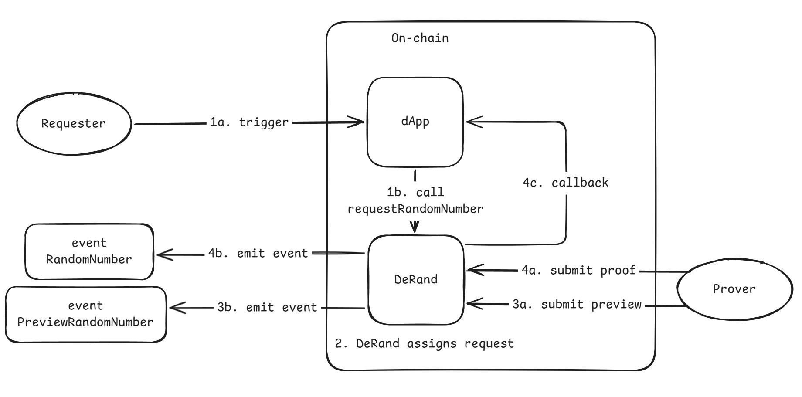
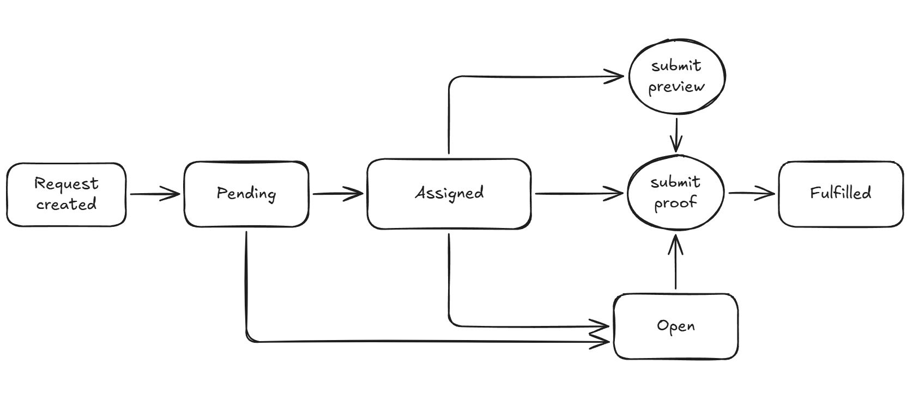

import Hint from '@site/src/components/Hint';

# Flow

1. A requester selects the desired parameters and submits a request to DeRand, either off-chain or through a dApp.
2. DeRand selects an available prover and assigns the request.
3. The prover generates the random number using a VDF and submits a [preview number](#preview-randomness).
4. The prover then generates a proof of the VDF computation and submits it for verification.

## Request Lifecycle

1. **Pending**: Your request is waiting to be assigned to a suitable prover.
2. **Assigned**: Your request has been assigned to a prover, who is expected to generate the proof.
3. **Open**: If a request remains in the Pending or Assigned state for too long, it is transitioned to Open. At this stage, ANYONE may submit a proof.
4. **Fulfilled**: The random value has been successfully generated and the proof has been verified.

## Preview Randomness

At present, DeRand uses zkSNARKs to generate proofs.

As a result, users may need to wait a significant amount of time before receiving the final verified random number. Depending on the chosen security configuration, proof generation may take anywhere from tens of minutes to several hours.

To improve user experience, DeRand supports preview random numbers.

A preview random number becomes available immediately after the VDF computation completes.

Since the proof has *NOT* yet been generated, the preview value is *NOT* yet cryptographically verified. It is merely claimed to be correct by the prover. Submitting an incorrect preview value results in <Hint hint="100 x Request Fee"> [**severe penalties**](/docs/02-concepts/04-fees.mdx#collateral) </Hint>.

Applications **MUST NOT** perform irreversible asset transfers or state transitions based solely on a preview random number.

Preview random numbers should be used exclusively for user experience improvements.

> ***Preview random numbers are optional and may not be available if a prover submits a proof directly without submitting preview random numbers.***
>
> ***However, if a prover fails to submit them within the required time window, the prover may be <Hint hint="up to 1 x Request Fee"> [**penalized**](/docs/02-concepts/04-fees.mdx#collateral) </Hint> according to the protocol rules.***

## Open State

If the assigned prover fails to submit a valid proof before the maximum allowed deadline, the request enters the **Open** state.

While in the **Open** state, anyone may submit a valid proof to complete the request and claim the associated reward.

See [Rewards, Penalties, and Compensation](./04-fees.mdx#rewards-penalties-and-compensation) for more details.
